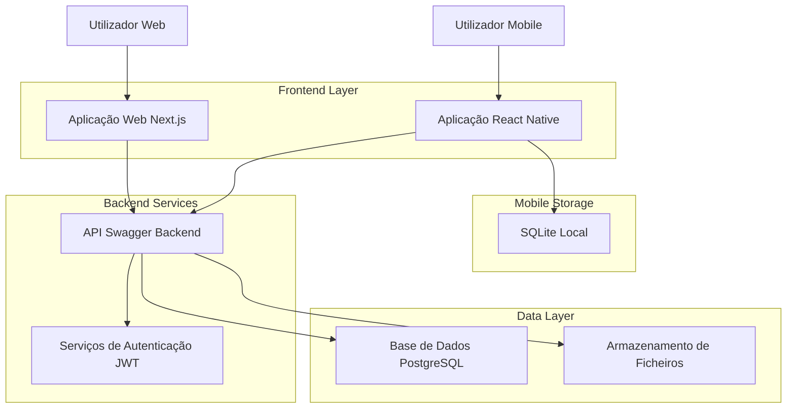
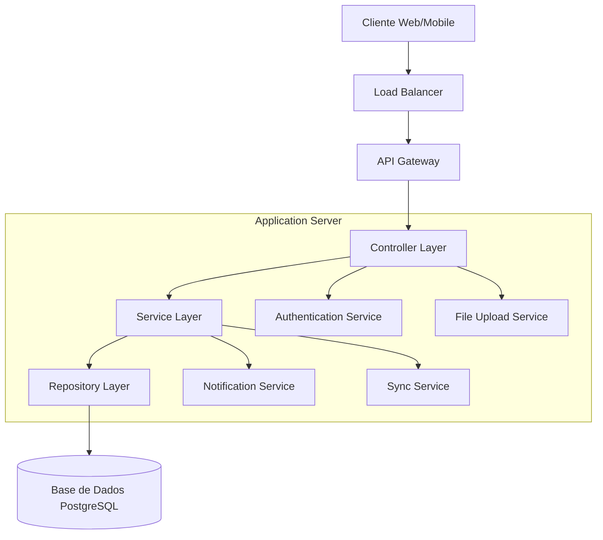
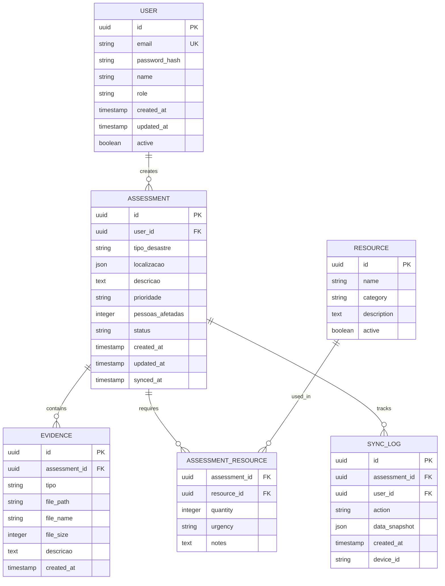

# Arquitetura Técnica - Sistema de Gestão de Avaliações de Desastres

## 1. Design da Arquitetura



## 2. Descrição das Tecnologias

### Aplicação Web

* **Frontend**: Next.js\@14 + TypeScript + Tailwind CSS + shadcn/ui

* **Mapas**: Leaflet.js\@1.9 + React-Leaflet

* **Gráficos**: Recharts\@2.8

* **Estado**: Zustand\@4.4 para gestão de estado global

* **HTTP Client**: Axios\@1.6 para comunicação com API

* **Formulários**: React Hook Form\@7.47 + Zod para validação

### Aplicação Mobile

* **Framework**: React Native\@0.72 + TypeScript

* **Navegação**: React <Navigation@6.x>

* **Estado Global**: Zustand\@4.4

* **Armazenamento Local**: SQLite via react-native-sqlite-storage\@6.0

* **HTTP Client**: Axios\@1.6 com interceptors para offline

* **Localização**: react-native-geolocation-service\@5.3

* **Câmara**: react-native-image-picker\@7.0

* **Sincronização**: Custom sync engine com queue management

### Backend (Existente)

* **API**: Swagger/OpenAPI 3.0 em <http://84.247.171.243:5000>

* **Autenticação**: JWT tokens

* **Base de Dados**: PostgreSQL (inferido)

* **Comunicação**: HTTPS/REST

## 3. Definições de Rotas

### Aplicação Web

| Rota                     | Propósito                                         |
| ------------------------ | ------------------------------------------------- |
| /                        | Dashboard principal com estatísticas e mapa geral |
| /avaliacoes              | Lista paginada de todas as avaliações com filtros |
| /avaliacoes/\[id]        | Página de detalhes de uma avaliação específica    |
| /avaliacoes/novo         | Formulário para criar nova avaliação              |
| /avaliacoes/\[id]/editar | Formulário para editar avaliação existente        |
| /relatorios              | Página de análise e geração de relatórios         |
| /configuracoes           | Configurações do utilizador e sistema             |
| /login                   | Página de autenticação                            |

### Aplicação Mobile (Stack Navigation)

| Ecrã                   | Propósito                                          |
| ---------------------- | -------------------------------------------------- |
| HomeScreen             | Lista de avaliações com indicador de sincronização |
| AvaliacaoFormScreen    | Formulário de criação/edição com GPS automático    |
| AvaliacaoDetalheScreen | Visualização detalhada de uma avaliação            |
| CameraScreen           | Captura de fotos e documentos                      |
| SyncScreen             | Gestão de sincronização e dados offline            |
| LoginScreen            | Autenticação do utilizador                         |
| ConfigScreen           | Configurações da aplicação                         |

## 4. Definições de API

### 4.1 APIs Principais

**Autenticação**

```
POST /api/auth/login
```

Request:

| Nome do Parâmetro | Tipo   | Obrigatório | Descrição           |
| ----------------- | ------ | ----------- | ------------------- |
| email             | string | true        | Email do utilizador |
| password          | string | true        | Palavra-passe       |

Response:

| Nome do Parâmetro | Tipo   | Descrição                               |
| ----------------- | ------ | --------------------------------------- |
| token             | string | JWT token para autenticação             |
| user              | object | Dados do utilizador autenticado         |
| expires\_in       | number | Tempo de expiração do token em segundos |

Exemplo:

```json
{
  "email": "coordenador@emergencia.pt",
  "password": "senha123"
}
```

**Gestão de Avaliações**

```
GET /api/avaliacoes
```

Request Parameters:

| Nome do Parâmetro | Tipo   | Obrigatório | Descrição                      |
| ----------------- | ------ | ----------- | ------------------------------ |
| page              | number | false       | Número da página (default: 1)  |
| limit             | number | false       | Itens por página (default: 20) |
| status            | string | false       | Filtro por estado da avaliação |
| date\_from        | string | false       | Data inicial (ISO 8601)        |
| date\_to          | string | false       | Data final (ISO 8601)          |
| location          | string | false       | Filtro por localização         |

```
POST /api/avaliacoes
```

Request:

| Nome do Parâmetro     | Tipo   | Obrigatório | Descrição                                         |
| --------------------- | ------ | ----------- | ------------------------------------------------- |
| tipo\_desastre        | string | true        | Tipo de desastre (incêndio, inundação, etc.)      |
| localizacao           | object | true        | Coordenadas GPS e endereço                        |
| descricao             | string | true        | Descrição detalhada da situação                   |
| prioridade            | string | true        | Nível de prioridade (baixa, média, alta, crítica) |
| pessoas\_afetadas     | number | false       | Número estimado de pessoas afetadas               |
| recursos\_necessarios | array  | false       | Lista de recursos necessários                     |

```
POST /api/avaliacoes/{assessment_id}/evidence
```

Request (multipart/form-data):

| Nome do Parâmetro | Tipo   | Obrigatório | Descrição                                  |
| ----------------- | ------ | ----------- | ------------------------------------------ |
| file              | file   | true        | Ficheiro de evidência (imagem, documento)  |
| tipo              | string | true        | Tipo de evidência (foto, documento, áudio) |
| descricao         | string | false       | Descrição da evidência                     |

**Estatísticas e Relatórios**

```
GET /api/avaliacoes/statistics
```

Response:

| Nome do Parâmetro  | Tipo   | Descrição                        |
| ------------------ | ------ | -------------------------------- |
| total\_avaliacoes  | number | Total de avaliações registadas   |
| avaliacoes\_ativas | number | Avaliações em curso              |
| por\_tipo          | object | Contagem por tipo de desastre    |
| por\_prioridade    | object | Contagem por nível de prioridade |
| tendencia\_mensal  | array  | Dados para gráfico de tendência  |

```
GET /api/avaliacoes/options
```

Response:

| Nome do Parâmetro     | Tipo  | Descrição                                   |
| --------------------- | ----- | ------------------------------------------- |
| tipos\_desastre       | array | Lista de tipos de desastre disponíveis      |
| niveis\_prioridade    | array | Níveis de prioridade possíveis              |
| recursos\_disponiveis | array | Tipos de recursos que podem ser solicitados |

## 5. Arquitetura do Servidor



## 6. Modelo de Dados

### 6.1 Definição do Modelo de Dados



### 6.2 Linguagem de Definição de Dados

**Tabela de Utilizadores (users)**

```sql
-- Criar tabela
CREATE TABLE users (
    id UUID PRIMARY KEY DEFAULT gen_random_uuid(),
    email VARCHAR(255) UNIQUE NOT NULL,
    password_hash VARCHAR(255) NOT NULL,
    name VARCHAR(100) NOT NULL,
    role VARCHAR(50) DEFAULT 'field_team' CHECK (role IN ('admin', 'coordinator', 'analyst', 'field_team')),
    created_at TIMESTAMP WITH TIME ZONE DEFAULT NOW(),
    updated_at TIMESTAMP WITH TIME ZONE DEFAULT NOW(),
    active BOOLEAN DEFAULT true
);

-- Criar índices
CREATE INDEX idx_users_email ON users(email);
CREATE INDEX idx_users_role ON users(role);
CREATE INDEX idx_users_active ON users(active);
```

**Tabela de Avaliações (assessments)**

```sql
-- Criar tabela
CREATE TABLE assessments (
    id UUID PRIMARY KEY DEFAULT gen_random_uuid(),
    user_id UUID NOT NULL REFERENCES users(id),
    tipo_desastre VARCHAR(100) NOT NULL,
    localizacao JSONB NOT NULL,
    descricao TEXT NOT NULL,
    prioridade VARCHAR(20) DEFAULT 'media' CHECK (prioridade IN ('baixa', 'media', 'alta', 'critica')),
    pessoas_afetadas INTEGER DEFAULT 0,
    status VARCHAR(20) DEFAULT 'ativa' CHECK (status IN ('ativa', 'em_progresso', 'resolvida', 'cancelada')),
    created_at TIMESTAMP WITH TIME ZONE DEFAULT NOW(),
    updated_at TIMESTAMP WITH TIME ZONE DEFAULT NOW(),
    synced_at TIMESTAMP WITH TIME ZONE
);

-- Criar índices
CREATE INDEX idx_assessments_user_id ON assessments(user_id);
CREATE INDEX idx_assessments_tipo_desastre ON assessments(tipo_desastre);
CREATE INDEX idx_assessments_prioridade ON assessments(prioridade);
CREATE INDEX idx_assessments_status ON assessments(status);
CREATE INDEX idx_assessments_created_at ON assessments(created_at DESC);
CREATE INDEX idx_assessments_localizacao ON assessments USING GIN(localizacao);
```

**Tabela de Evidências (evidence)**

```sql
-- Criar tabela
CREATE TABLE evidence (
    id UUID PRIMARY KEY DEFAULT gen_random_uuid(),
    assessment_id UUID NOT NULL REFERENCES assessments(id) ON DELETE CASCADE,
    tipo VARCHAR(50) NOT NULL CHECK (tipo IN ('foto', 'documento', 'audio', 'video')),
    file_path VARCHAR(500) NOT NULL,
    file_name VARCHAR(255) NOT NULL,
    file_size INTEGER NOT NULL,
    descricao TEXT,
    created_at TIMESTAMP WITH TIME ZONE DEFAULT NOW()
);

-- Criar índices
CREATE INDEX idx_evidence_assessment_id ON evidence(assessment_id);
CREATE INDEX idx_evidence_tipo ON evidence(tipo);
CREATE INDEX idx_evidence_created_at ON evidence(created_at DESC);
```

**Dados Iniciais**

```sql
-- Inserir tipos de desastre padrão
INSERT INTO disaster_types (name, category, description) VALUES
('Incêndio Florestal', 'natural', 'Incêndios em áreas florestais'),
('Inundação', 'natural', 'Alagamentos por chuvas ou transbordamento'),
('Deslizamento', 'natural', 'Deslizamento de terras'),
('Acidente Rodoviário', 'artificial', 'Acidentes em vias públicas'),
('Explosão', 'artificial', 'Explosões em edifícios ou instalações');

-- Inserir recursos padrão
INSERT INTO resources (name, category, description) VALUES
('Ambulância', 'medical', 'Veículo de emergência médica'),
('Bombeiros', 'rescue', 'Equipa de bombeiros'),
('Polícia', 'security', 'Forças policiais'),
('Helicóptero', 'transport', 'Transporte aéreo de emergência'),
('Abrigo Temporário', 'shelter', 'Instalações para desalojados');
```

