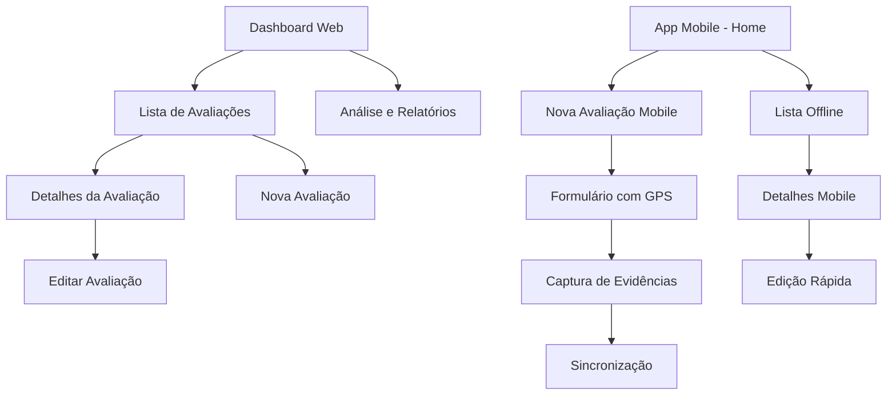

# Documento de Requisitos do Produto - Sistema de Gestão de Avaliações de Desastres

## 1. Visão Geral do Produto

O Sistema de Gestão de Avaliações de Desastres é uma solução completa composta por duas aplicações integradas: uma plataforma web para coordenação e análise, e uma aplicação mobile offline-first para equipas no terreno. O sistema permite o registo, gestão e análise de avaliações de desastres com sincronização automática entre dispositivos.

* **Problema a resolver**: Necessidade de coordenação eficiente entre equipas de terreno e centros de coordenação durante situações de emergência e desastres naturais.

* **Utilizadores-alvo**: Equipas de emergência, coordenadores de desastres, analistas e gestores de operações de socorro.

* **Valor do produto**: Melhoria na resposta a emergências através de dados em tempo real, análise centralizada e capacidade offline para registo no terreno.

## 2. Funcionalidades Principais

### 2.1 Papéis de Utilizador

| Papel             | Método de Registo                  | Permissões Principais                                              |
| ----------------- | ---------------------------------- | ------------------------------------------------------------------ |
| Coordenador       | Registo por convite administrativo | Acesso completo ao dashboard, análise de dados, gestão de equipas  |
| Analista          | Registo por email com aprovação    | Visualização de dados, criação de relatórios, análise estatística  |
| Equipa de Terreno | Registo via código de acesso       | Registo de avaliações, upload de evidências, sincronização offline |
| Administrador     | Criação manual pelo sistema        | Gestão completa de utilizadores, configurações e dados             |

### 2.2 Módulos Funcionais

O sistema é composto pelas seguintes páginas principais:

**Aplicação Web:**

1. **Dashboard Principal**: visão geral estatística, mapas interativos, alertas em tempo real
2. **Lista de Avaliações**: filtros avançados, ordenação, exportação de dados
3. **Detalhes da Avaliação**: informações completas, evidências, histórico de alterações
4. **Formulário de Criação/Edição**: campos dinâmicos, validação, upload de ficheiros
5. **Análise e Relatórios**: gráficos interativos, estatísticas, exportação

**Aplicação Mobile:**

1. **Ecrã Principal**: lista de avaliações, indicador de sincronização, acesso rápido
2. **Formulário de Registo**: campos otimizados, GPS automático, captura de fotos
3. **Detalhes da Avaliação**: visualização offline, edição rápida
4. **Sincronização**: gestão de dados offline, upload automático

### 2.3 Detalhes das Páginas

| Nome da Página          | Nome do Módulo          | Descrição da Funcionalidade                                                                             |
| ----------------------- | ----------------------- | ------------------------------------------------------------------------------------------------------- |
| Dashboard Web           | Visão Geral             | Exibir estatísticas em tempo real, mapa com localizações, alertas críticos, resumo de atividades        |
| Dashboard Web           | Mapa Interativo         | Visualizar avaliações por localização, filtros geográficos, clustering de pontos, popup com informações |
| Lista de Avaliações Web | Sistema de Filtros      | Filtrar por data, tipo, estado, localização, equipa responsável com pesquisa avançada                   |
| Lista de Avaliações Web | Tabela de Dados         | Exibir dados tabulares, ordenação, paginação, seleção múltipla, ações em lote                           |
| Detalhes Web/Mobile     | Informações Principais  | Mostrar dados completos da avaliação, coordenadas GPS, timestamps, estado atual                         |
| Detalhes Web/Mobile     | Galeria de Evidências   | Visualizar fotos/documentos, download, organização por tipo, zoom e navegação                           |
| Formulário Web/Mobile   | Campos Dinâmicos        | Campos adaptativos baseados no tipo de desastre, validação em tempo real, auto-save                     |
| Formulário Mobile       | Captura GPS             | Obter coordenadas automáticas, permitir ajuste manual, validação de precisão                            |
| Formulário Mobile       | Captura de Mídia        | Tirar fotos, gravar áudio, anexar documentos, compressão automática                                     |
| Sincronização Mobile    | Gestão Offline          | Armazenar dados localmente, detectar conectividade, sincronizar automaticamente, resolver conflitos     |
| Relatórios Web          | Gráficos e Estatísticas | Gerar gráficos interativos, exportar dados, análise temporal, comparações                               |

## 3. Processo Principal

### Fluxo do Coordenador (Web):

1. Acesso ao dashboard para visão geral da situação
2. Análise de dados através de mapas e gráficos
3. Criação de novas avaliações quando necessário
4. Monitorização de avaliações em curso
5. Geração de relatórios e análises

### Fluxo da Equipa de Terreno (Mobile):

1. Abertura da aplicação (funciona offline)
2. Criação de nova avaliação com GPS automático
3. Preenchimento de formulário otimizado
4. Captura de fotos e evidências
5. Sincronização automática quando há conectividade

## 4. Design da Interface de Utilizador

### 4.1 Estilo de Design

**Aplicação Web:**

* **Cores primárias**: Azul (#2563eb) para ações principais, Vermelho (#dc2626) para alertas críticos

* **Cores secundárias**: Cinza (#64748b) para texto secundário, Verde (#16a34a) para estados positivos

* **Estilo de botões**: Componentes shadcn/ui com bordas arredondadas (8px), efeitos hover suaves

* **Tipografia**: Inter como fonte principal, tamanhos 14px (corpo), 16px (títulos), 24px (cabeçalhos)

* **Layout**: Design baseado em cards, navegação superior fixa, sidebar colapsável

* **Ícones**: Lucide React para consistência, estilo outline

**Aplicação Mobile:**

* **Cores**: Esquema similar ao web com maior contraste para visibilidade exterior

* **Botões**: Tamanho mínimo 44px para toque, espaçamento generoso

* **Tipografia**: Tamanhos maiores (16px corpo, 18px títulos) para legibilidade

* **Layout**: Design mobile-first, navegação por tabs, gestos intuitivos

* **Ícones**: Filled style para melhor visibilidade em dispositivos móveis

### 4.2 Visão Geral do Design das Páginas

| Nome da Página | Nome do Módulo | Elementos de UI                                                                               |
| -------------- | -------------- | --------------------------------------------------------------------------------------------- |
| Dashboard Web  | Hero Section   | Cards com estatísticas, gráficos Recharts, mapa Leaflet fullscreen, cores de estado dinâmicas |
| Dashboard Web  | Navegação      | Sidebar com ícones, breadcrumbs, notificações em tempo real, avatar do utilizador             |
| Lista Web      | Filtros        | Componentes shadcn/ui Select, DatePicker, Input com ícones, botões de reset                   |
| Lista Web      | Tabela         | DataTable responsiva, ordenação visual, paginação, checkboxes para seleção                    |
| Formulário Web | Campos         | Form components shadcn/ui, validação visual, progress indicator, auto-save feedback           |
| Mobile Home    | Lista          | Cards touch-friendly, pull-to-refresh, indicadores de sincronização, FAB para nova avaliação  |
| Mobile Form    | Entrada        | Inputs otimizados, teclado contextual, botões de captura prominentes, GPS indicator           |
| Mobile Sync    | Estado         | Progress bars, ícones de estado, mensagens claras, retry buttons                              |

### 4.3 Responsividade

**Aplicação Web:**

* Design desktop-first com adaptação para tablets (768px+) e mobile (320px+)

* Sidebar colapsável em dispositivos menores

* Tabelas com scroll horizontal em mobile

* Mapas com controlos adaptados ao toque

**Aplicação Mobile:**

* Design nativo mobile-first

* Otimização para toque com áreas mínimas de 44px

* Suporte para orientação portrait e landscape

* Adaptação para diferentes tamanhos de ecrã (5" a 12")

* Gestos nativos (swipe, pinch-to-zoom, pull-to-refresh)

